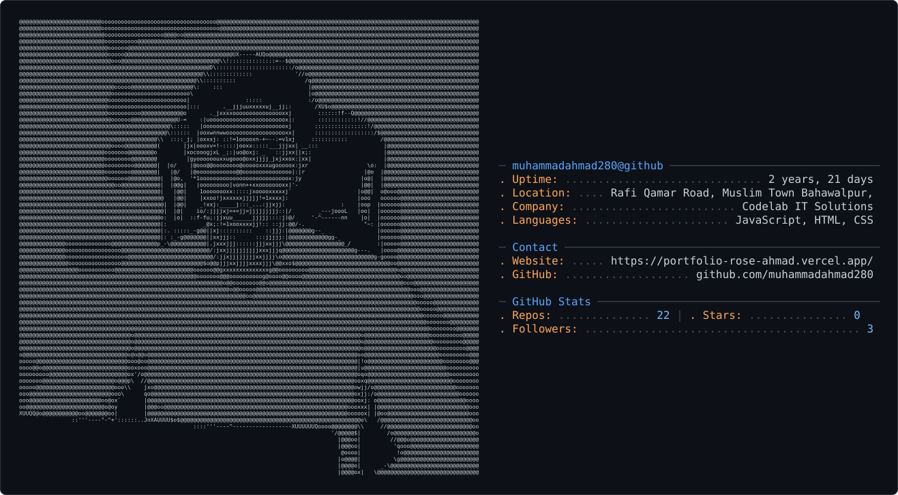

<h1 align="center">Hey, I'm Ahmad 👋</h1>
 
<p align="center">
  
</p>

<picture>
  <source media="(prefers-color-scheme: dark)" srcset="dark_mode.svg" />
  <source media="(prefers-color-scheme: light)" srcset="light_mode.svg" />
  
</picture>

 
### About Me
 
```php
<?php
 
class Asad
{
    public string $role     = 'Full Stack Web Developer';
    public string $location = 'Lahore, Pakistan 🇵🇰';
 
    public array $stack = [
        'backend'  => ['PHP', 'Laravel', 'REST API', 'Laravel Sanctum'],
        'database' => ['MySQL', 'PostgreSQL', 'Database Design', 'Redis'],
        'frontend' => ['Blade', 'TailwindCSS', 'Bootstrap', 'JavaScript'],
    ];
 
    public array $practices = [
        'SOLID Principles',
        'Clean Architecture',
        'Service · Repository · DTO Pattern',
        'nWidart Modular Architecture',
    ];
 
    public function currentlyLearning(): string
    {
        return 'Advanced System Design & PostgreSQL Internals';
    }
}
```
 
---
 
<!-- ===================== ⚡ TECH STACK & TOOLS ⚡ ===================== -->

<div align="center">

  <!-- Full-width gradient wave banner -->
  <a href="https://github.com/Masad791?tab=repositories">
    
  </a>

  <!-- Animated typing line -->
  <a href="https://git.io/typing-svg">
    
  </a>

  <!-- BACKEND -->
  <br/>
  
  <br/><br/>

  <a href="https://www.php.net"></a>
  <a href="https://laravel.com"></a>
  <a href="https://laravel.com/docs/sanctum"></a>

  <!-- DATABASE -->
  <br/><br/>
  
  <br/><br/>

  <a href="https://www.mysql.com"></a>
  <a href="https://www.postgresql.org"></a>
  <a href="https://redis.io"></a>

  <!-- FRONTEND -->
  <br/><br/>
  
  <br/><br/>

  <a href="https://developer.mozilla.org/en-US/docs/Web/HTML"></a>
  <a href="https://developer.mozilla.org/en-US/docs/Web/CSS"></a>
  <a href="https://developer.mozilla.org/en-US/docs/Web/JavaScript"></a>
  <a href="https://tailwindcss.com"></a>
  <a href="https://getbootstrap.com"></a>

  <!-- TOOLS -->
  <br/><br/>
  
  <br/><br/>

  <a href="https://git-scm.com"></a>
  <a href="https://www.postman.com"></a>
  <a href="https://cloudinary.com"></a>

  <br/><br/>
  <!-- Full-width closing wave -->
  

</div>


<picture>
  <source media="(prefers-color-scheme: dark)" srcset="https://raw.githubusercontent.com/Masad791/Masad791/output/github-snake-dark.svg"/>
  <source media="(prefers-color-scheme: light)" srcset="https://raw.githubusercontent.com/Masad791/Masad791/output/github-snake.svg"/>
  
</picture>
